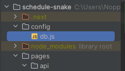

# Getting Started
After git cloning, please make a config/db.js file in the project directory. Should look like this:</br>
</br>
Contents of ```db.js``` should be privately sent on Discord.

# API Calls:
Note: For legibility, 'host' in API calls below will mean http://localhost:3000, or other ports or local addresses you're running on. If you would like to test out the calls, I recommend using Postman for making these requests.
### Getting Started
To get started, make sure your config/db.js is set up. Once done so, test your connection:</br> 
Send ```host/api/testConnection``` as a GET request with no arguments after running ```npm run dev```
### SELECT statements
Currently only supports statements that receive arguments column, table, and condition</br>
SELECT statement endpoint is found in select.ts at ```host/api/select```</br>
Examples:</br>
```host/api/select?table=professor```</br>
```host/api/select?table=student&columns=name,age,year```</br>
```host/api/select?table=student&columns=name&condition=age=22 AND year='Senior'```
### INSERT INTO statements
Supports basic parameters table, category, and value where category and value can be inserted multiple times to choose values for all needed columns.
Note that the API request will detect if the category and values are unequal, requiring a proper API request. The request will also
respect the order in which each category/column and value is sent in.</br>
INSERT INTO statement endpoint is found in insertInto.ts at ```host/api/insertInto```</br>
Examples:</br>
```host/api/insertInto?table=student&category=name&category=age&category=year&value='Douglas'&value=24&value='Senior'```
### DELETE FROM statements
Supports parameters table and conditions. Deletes a row from a given table.</br>
DELETE FROM statement endpoint is found in delete.ts at ```host/api/delete```</br>
Examples:</br>
```host/api/delete?table=professor&condition=name="Troeger"```
# Connecting to Docker (Still WIP)
```
docker pull gradlee/schedule-snake:latest
docker run -p 3000:8080 gradlee/schedule-snake:latest
```